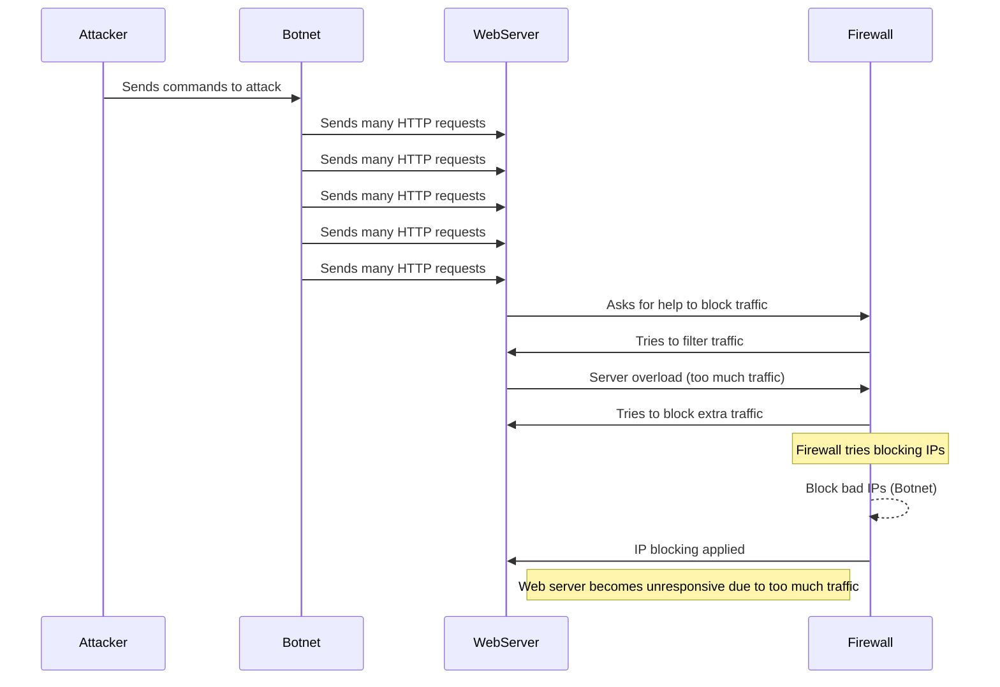

1. The attacker must create a Botnet using several compromised devices that the attacker can control. When the attacker has created the Botnet and selected a target they will then send a command to the Botnet to attack the Webserver. 
2. The Botnet executes the command to attack the Webserver by flooding it with a large amount of requests.  
3. The Webserver tries to respond to the large number of requests, but is overwhelmed and is now uncapable of responding to real requests. 
4. The Firewall may detect an unusually high amount of traffic and attempt to intervene by blocking IP addresses. Success varies based on type of DDoS attack.    

